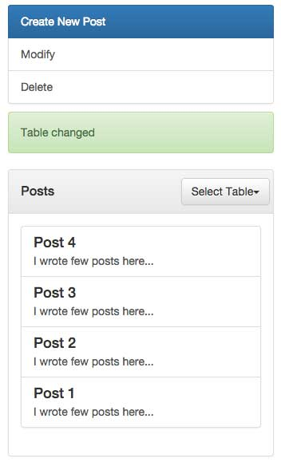
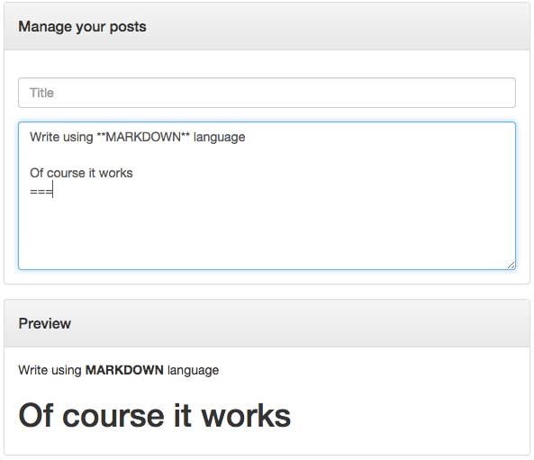

#PPostManager [by Nicola Bombaci](http://nicolabombaci.com/ "Nicola Bombaci Webpage")
With PPostManager you can manage a little databse on your personal webpage. If you are not using CMS like Wordpress,
Joomla or others, you can use this little tool to **create**, **modify** or **delete** your post.
 

 
First of all let's think about our DB.
 
I thought, in my opinion, that to create a post for our article, we need: a **title**, a **content**, an **id** as primary key 
and a **date**.
 
So let's create our *database* and our *tables* with coloumns: **title**, **post**, **id** (Primary Key), **date**.

Next step will be setting the file *common/config.php* and insert:

**$host** = "ourhost";

**$db_user** = "ouruser";

**$db_psw** = "ourpassword";

**$db_name** = "ourdatabase";

After this, our tool is ready to work. We will have two fields: **Title** and **Post**. When we write a post we will do it
with markdown language and on live we will see the results on the window, **Preview**.

To **Create** a new post, we must type on title field, on post field and press **Create New Post**.

To **Update** a post, select an item from menu **Select Table** and click on the post to modify, the fields title and post will update
and you could change the previous strings. When you will finish press **Modify**.

To **Delete** a post select an item from menu **Select Table** and click on the post to delete, than press **Delete**.

Thanks to [Jquery](https://jquery.com/ "Jquery") for the engine, [Bootstrap](http://getbootstrap.com/ "Bootstrap") for the graphics
and many thanks to [erusev](https://github.com/erusev "erusev") and his [Parsedown](https://github.com/erusev/parsedown "Parser Markdown").

